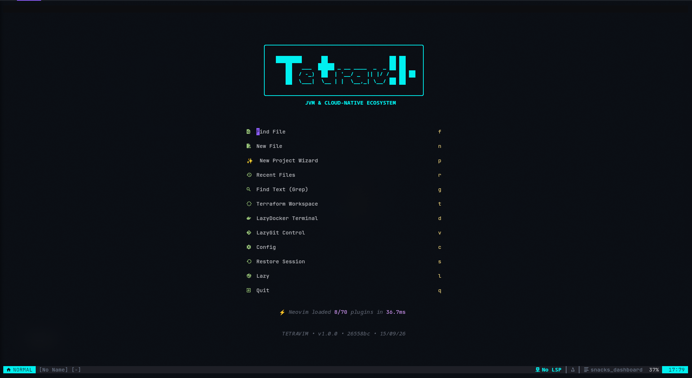
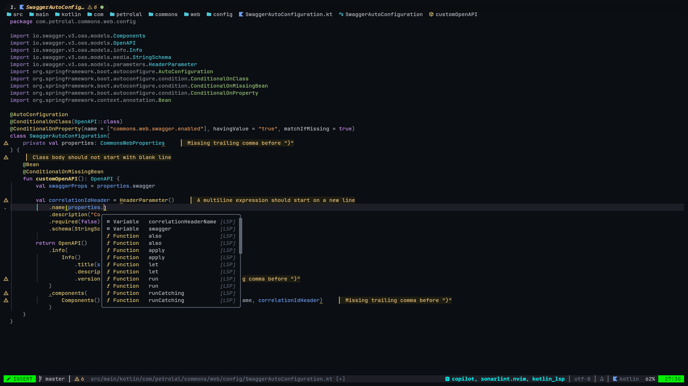
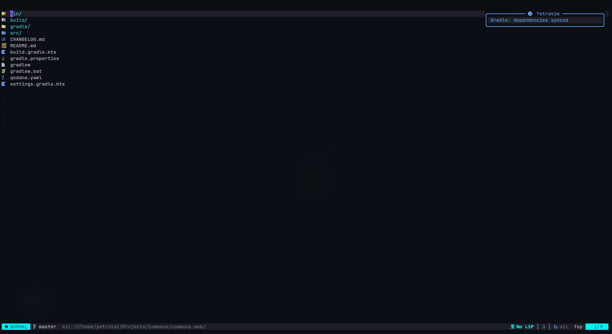

<div align="center">


</div>

---

<h4 align="center">
  <a href="#-installation">Install</a>
  ·
  <a href="#-requirements">Requirements</a>
  ·
  <a href="#-features">Features</a>
  ·
  <a href="docs/README.md">Documentation</a>
  ·
  <a href="#-basic-setup">Setup</a>
  ·
  <a href="#-keymaps--navigation">Keymaps</a>
  ·
  <a href="#-file-structure">Structure</a>
  ·
  <a href="docs/README.md#6-intellij-idea-ultimate-parity-matrix">IntelliJ Parity</a>
</h4>

<p align="center">
    <a href="https://github.com/petrolal/TetraVim/pulse"></a>
    <a href="https://github.com/petrolal/TetraVim/releases/latest"></a>
    <a href="https://github.com/petrolal/TetraVim/stargazers"></a>
    <a href="https://github.com/petrolal/TetraVim/blob/main/LICENSE"></a>
    <br>
    <a href="https://neovim.io"></a>
    <a href="https://adoptium.net/"></a>
    <a href="https://spring.io/projects/spring-boot"></a>
    <a href="https://github.com/petrolal/TetraVim/actions"></a>
</p>

<p align="center">
<strong>TetraVim</strong> is an enterprise-ready, pure native Neovim distribution engineered for modern JVM backend development (Java, Kotlin, Scala, Gradle, Maven) and Cloud Native infrastructure (Terraform, Kubernetes, Docker, Ansible). Built on the standard Neovim ecosystem as a fast, robust alternative to heavy IDEs.
</p>

## 🌟 Preview







## ✨ Features

- **JVM Backend Platform**:
  - Full Java intelligence via [nvim-jdtls](https://github.com/mfussenegger/nvim-jdtls) with bundled debugging (`java-debug`) and testing (`java-test`)
  - Kotlin language server integration with [kotlin-language-server](https://github.com/fwcd/kotlin-language-server)
  - Scala and SBT integration with [nvim-metals](https://github.com/scalameta/nvim-metals)
  - Spring Boot symbol navigation, bean graph, and property completion via [spring-boot.nvim](https://github.com/JavaHello/spring-boot.nvim)
  - Quarkus & MicroProfile config intelligence via [quarkus.nvim](https://github.com/JavaHello/quarkus.nvim) & [microprofile.nvim](https://github.com/JavaHello/microprofile.nvim)
  - Native JaCoCo test coverage overlays (`<leader>jc`) and test runner with [Neotest](https://github.com/nvim-neotest/neotest)
- **Cloud Native & DevOps**:
  - Infrastructure as Code with Terraform (`terraformls`, `tflint`), CloudFormation, and Ansible (`ansible-language-server`, `ansible-lint`)
  - Containers & Orchestration with Docker (`dockerfile-language-server`, `hadolint`), Kubernetes, and Helm (`helm-ls`)
  - Database Management with full SQL query console and datasource auto-discovery via [vim-dadbod](https://github.com/tpope/vim-dadbod) & [vim-dadbod-ui](https://github.com/kristijanhusak/vim-dadbod-ui)
  - API & Protocol Testing with in-editor HTTP client ([Kulala.nvim](https://github.com/mistweaverco/kulala.nvim)), OpenAPI / Swagger explorer, and gRPC UI ([grpcui](https://github.com/fullstorydev/grpcui))
- **Editor, UI & Navigation**:
  - Buffer-as-filesystem navigation with [Oil.nvim](https://github.com/stevearc/oil.nvim) and [Snacks Picker / Explorer](https://github.com/folke/snacks.nvim)
  - Blazing fast fuzzy finding, dashboard, and notifications powered by [Snacks.nvim](https://github.com/folke/snacks.nvim) & [Telescope](https://github.com/nvim-telescope/telescope.nvim)
  - Rich autocompletion and snippet expansion via [nvim-cmp](https://github.com/hrsh7th/nvim-cmp) & [LuaSnip](https://github.com/L3MON4D3/LuaSnip)
  - Winbar breadcrumbs and symbol path picker with [dropbar.nvim](https://github.com/Bekaboo/dropbar.nvim)
  - Dedicated high-contrast **Tetris** dark color scheme with full semantic token highlighting
  - Git integration with [Gitsigns](https://github.com/lewis6991/gitsigns.nvim), [Neogit](https://github.com/NeogitOrg/neogit), and [Diffview](https://github.com/sindrets/diffview.nvim)
  - Structure outline with [outline.nvim](https://github.com/hedyhli/outline.nvim) and project search & replace with [grug-far.nvim](https://github.com/MagicDuck/grug-far.nvim)
  - Syntax highlighting via [Treesitter](https://github.com/nvim-treesitter/nvim-treesitter)
  - Formatting & Linting via [conform.nvim](https://github.com/stevearc/conform.nvim) & [nvim-lint](https://github.com/mfussenegger/nvim-lint)
- **Code Quality & Security**:
  - Live SonarLint diagnostics & SonarQube rule inspection via [sonarlint-language-server](https://github.com/SonarSource/sonarlint-language-server)
  - Automated dependency CVE vulnerability auditing via [osv-scanner](https://github.com/google/osv-scanner) for Maven and Gradle
- **AI Coding Assistance**:
  - Modular AI assistant support with [Avante.nvim](https://github.com/yetone/avante.nvim), [CodeCompanion](https://github.com/olimorris/codecompanion.nvim), and [Copilot](https://github.com/zbirenbaum/copilot.lua)

## ⚡ Requirements

- [Neovim ≥ 0.11](https://github.com/neovim/neovim/releases/tag/stable) <sup>[[1]](#1)</sup>
- [Java JDK ≥ 17](https://adoptium.net/) (Required for JDTLS, Metals, Kotlin LS; Java 21+ supported) <sup>[[2]](#2)</sup>
- [Nerd Fonts (v3.0+)](https://www.nerdfonts.com/font-downloads) (e.g. _JetBrainsMono Nerd Font_) <sup>[[3]](#3)</sup>
- [ripgrep](https://github.com/BurntSushi/ripgrep) and [fd](https://github.com/sharkdp/fd) (for live grep and picker search)
- A C compiler (`gcc`, `clang`, or `cc`) & `make` (for Tree-sitter parsers and telescope-fzf-native)
- [Git](https://git-scm.com/) (for plugin management via `lazy.nvim`)
- Terminal with true color (24-bit) support <sup>[[4]](#4)</sup>
- Optional Requirements:
  - [osv-scanner](https://github.com/google/osv-scanner) - dependency CVE vulnerability audits (`<leader>xv`)
  - [grpcurl](https://github.com/fullstorydev/grpcurl) & [grpcui](https://github.com/fullstorydev/grpcui) - gRPC interactive client (`<leader>ag`)
  - [Docker](https://www.docker.com/) & [kubectl](https://kubernetes.io/docs/tasks/tools/) - container and cluster management (`<leader>od`, `<leader>ok`)
  - [lazygit](https://github.com/jesseduffield/lazygit) - Git TUI modal (`<leader>gg`)

## 🛠️ Installation

TetraVim installs to `~/TetraVim` and symlinks `~/.config/nvim` directly to it, ensuring clean synchronization and Git tracking.

<details><summary>Interactive Quickstart (Linux / macOS)</summary>

Run the one-line installer:

```bash
curl -fsSL https://raw.githubusercontent.com/petrolal/TetraVim/main/install.sh | bash
```

</details>

<details><summary>Manual Installation</summary>

- Make a backup of your current Neovim state

```shell
mv ~/.config/nvim ~/.config/nvim.bak
mv ~/.local/share/nvim ~/.local/share/nvim.bak
mv ~/.local/state/nvim ~/.local/state/nvim.bak
mv ~/.cache/nvim ~/.cache/nvim.bak
```

- Clone and run bootstrap

```shell
git clone https://github.com/petrolal/TetraVim.git ~/TetraVim
cd ~/TetraVim
bash bootstrap.sh
```

The interactive bootstrap verifies system dependencies, syncs Lazy.nvim plugins, provisions Mason tools, downloads JVM extension bundles, and validates installation health.

</details>

<details><summary>🐳 Try it with Docker</summary>

Anyone can test TetraVim in an isolated, disposable container without installing Neovim, Java, or dependencies on their host machine:

```bash
docker run -w /root --net=host -it --rm alpine:edge sh -c '
	apk add sudo curl bash git neovim fzf ripgrep lazygit make && \
	curl -fsSL https://raw.githubusercontent.com/petrolal/TetraVim/main/install.sh | bash && \
    cd ~/.config/nvim \
	nvim
'
```

</details>

## 🚀 Contributing

Contributions are warmly welcomed! Please check our [Code of Conduct](CODE_OF_CONDUCT.md) before participating. Pull requests and feature suggestions are evaluated through our CI verification suites (`stylua`, Plenary busted tests, and headless provisioning checks).

## 📂 File Structure

The files under `lua/TetraVim/core/` are automatically loaded at the appropriate time, so you don't need to require those files manually.
**TetraVim** comes with a modular core configuration that sets up options, keymaps, autocmds, and diagnostics.

All plugin specifications are organized under `lua/TetraVim/plugins/` and automatically loaded by [lazy.nvim](https://github.com/folke/lazy.nvim).

<pre>
~/.config/nvim
├── colors
│   └── TetraVim.lua
├── ftplugin
│   ├── java.lua
│   ├── kotlin.lua
│   ├── sql.lua
│   └── **
├── lua
│   └── TetraVim
│       ├── core
│       │   ├── autocmds.lua
│       │   ├── devops.lua
│       │   └── **
│       ├── health
│       │   ├── ai.lua
│       │   ├── devops.lua
│       │   ├── jvm.lua
│       │   └── **
│       ├── plugins
│       │   ├── ai-*.lua
│       │   ├── cloud-*.lua
│       │   └── **
│       ├── theme
│       │   ├── init.lua
│       │   └── tetris.lua
│       └── util
│           ├── ai
│           └── **
├── bootstrap.sh
├── init.lua
└── install.sh
</pre>

## ⭐ Credits

Sincere appreciation to the following projects, plugin authors, and the Neovim community that make TetraVim possible:

- [Neovim](https://neovim.io)
- [AstroNvim](https://astronvim.com)
- [Snacks.nvim](https://github.com/folke/snacks.nvim) & [folke](https://github.com/folke)
- [nvim-jdtls](https://github.com/mfussenegger/nvim-jdtls) & Eclipse JDT LS
- [nvim-metals](https://github.com/scalameta/nvim-metals)
- [spring-boot.nvim](https://github.com/JavaHello/spring-boot.nvim) & [JavaHello](https://github.com/JavaHello)
- [Oil.nvim](https://github.com/stevearc/oil.nvim) & [stevearc](https://github.com/stevearc)
- [NvChad](https://github.com/NvChad/NvChad)
- [LunarVim](https://github.com/LunarVim)
